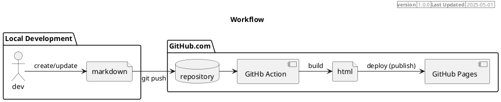

# :octicons-stack-16: Site Architecture

## Overview

This website is hosted on [GitHub Pages](https://pages.github.com){target="_blank"}.

Contents are created in [Markdown](https://www.markdownguide.org){target="_blank"} and uses [Material for MkDocs](https://squidfunk.github.io/mkdocs-material/){target="_blank"} as the Static Page Generator to render the Markdown files into [HTML](https://en.wikipedia.org/wiki/HTML){target="_blank"} files.

The source files are stored into a Git repository hosted on GitHub.com and uses [GitHub Action](https://github.com/features/actions){target="_blank"} as automation to build and deploy into GitHub Pages.

## Workflow

<figure markdown="span">

<figcaption> Workflow </figcaption>
</figure>

## Directory Structure

=== "Directory Structure"

    ```bash
    .
    ├── 📂 docs
    │   ├── 📂 about
    │   │   ├── site-architecture.md
    │   │   └── ...
    │   ├── 📂 assets
    │   │   ├── 📂 images
    │   │   └── 📂 javascripts
    │   ├── index.md
    │   ├── 📂 blog
    │   │   ├── 📂 posts
    │   │   └── ...
    │   ├── 📂 documentaions
    │   │   ├── 📂 automation
    │   │   ├── 📂 github-copilot
    │   │   └── ...
    │   ├── 📂 overrides
    │   │   ├── 📂 partials
    │   │   └── ...
    │   └── ...
    ├── 📄 mkdocs.yml
    ├── 📂 .github
    │   └── 📂 workflows
    │       └── 📄 gh-pages.yml
    ├── .gitignore
    ├── 📄 LICENSE
    ├── 📄 README.md
    └── 📄 requirements.txt
    ```
=== "Details"

    - `📂 docs`: Contains all the Markdown files and assets for the website.
        - `📂 about`: Contains documentation about the site architecture and other related information.
        - `📂 assets`: Contains CSS, images, and JavaScript files used in the website.
        - `📂 blog`: Contains all blog posts
        - `📂 documentation`: Contains various sections of the documentation, such as getting started, guides, and reference.
        - `📂 overrides`: Contains override configurations to the default templates of Material MkDocs
        - `mkdocs.yml`: The configuration file for MkDocs, which defines the structure and settings of the website.
        - `.github`: Contains GitHub Actions workflows for automating the build and deployment process.
            - `workflows`: Contains the workflow files for GitHub Actions.
                - `gh-pages.yml`: The workflow file that defines the steps to build and deploy the website to GitHub Pages.
        - `.gitignore`: Specifies files and directories that should be ignored by Git.
        - `LICENSE`: The license file for the project.
        - `README.md`: The main README file for the project, providing an overview and instructions.
        - `requirements.txt`: Lists the Python packages required for the project, including MkDocs and any plugins used.