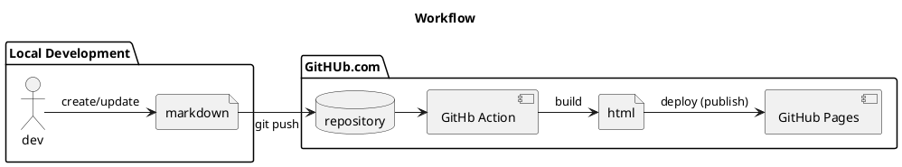

# :octicons-stack-16: Site Architecture

## Overview

This website is hosted on [GitHub Pages](https://pages.github.com){target="_blank"}.

Contents are created in [Markdown](https://www.markdownguide.org){target="_blank"} and uses [Material for MkDocs](https://squidfunk.github.io/mkdocs-material/){target="_blank"} as the Static Page Generator to render the Markdown files into [HTML](https://en.wikipedia.org/wiki/HTML){target="_blank"} files.

The source files are stored into a Git repository hosted on GitHub.com and uses [GitHub Action](https://github.com/features/actions){target="_blank"} as automation to build and deploy into GitHub Pages.

## Workflow

<figure markdown="span">

<figcaption>Workflow </figcaption>
</figure>