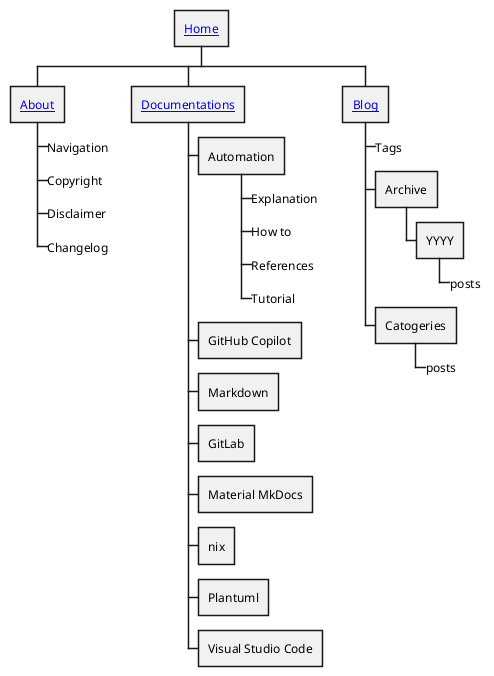

# :material-compass: Navigation

## Overview

> On this page, you will learn how to navigate to various sections on this website to look for contents

## Site Navigation Map



<!-- see https://github.com/MikhailKravets/mkdocs_puml/issues/89 
```puml
--8<-- "docs/about/puml/site-navi.puml"
```
-->


