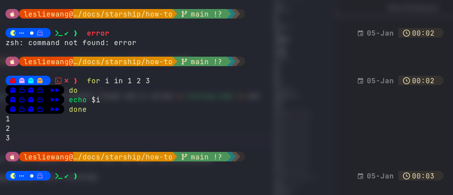

# :octicons-package-dependents-16: How to configure

The official Configuration guide is available on [**https://starship.rs/config/**](https://starship.rs/config/){target="_blank"}.

## Configuration File Location

The configuration file is a plain text file that uses the [TOML](https://toml.io/en/){target="_blank"} format and is called **`starship.toml`** and is typically located in **`~/.config/starship.toml`**.

## My Starship configuration

Inspired by :

- <span style="color: yellow;">` 󰮯 `</span>[Perfect Pacman](https://www.youtube.com/watch?v=R8QR98dioFQ){target="_blank"} 
- <span style="color: yellow;">` 󰮯 `</span>[Pac-Man Wasn’t Made for Gamers… And That’s Why It Worked](https://www.youtube.com/watch?v=Cnf19oS5Slk){target="_blank"} 

!!! warning "Important Note"
    
    These configurations are tailored to my personal preferences and setup. Feel free to modify it to suit your own needs and preferences.

    Some Nerd Fonts symbols may not render correctly if you don't have the appropriate fonts installed.

!!! success "Additional customizations"

    The prompt is based on the [Gruvbox Rainbow Preset](https://starship.rs/presets/gruvbox-rainbow){target="_blank"} with additional customizations with Pacman and Ghost glyphs for the command prompt symbols.

??? tip "screenshot"

    {.center-image}
    
    

```toml title="~/.config/starship.toml" linenums="1"


"$schema" = 'https://starship.rs/config-schema.json'

format = """
[](color_purple)\
$os\
[](color_purple)\
[](color_orange)\
$username$hostname$directory\
[](fg:color_yellow bg:color_aqua)\
$git_branch\
$git_status\
[](fg:color_aqua bg:color_blue)\
$c\
$cpp\
$rust\
$golang\
$nodejs\
$php\
$java\
$kotlin\
$haskell\
$python\
[](fg:color_blue bg:color_bg3)\
$docker_context\
$conda\
$pixi\
[](fg:color_bg3 bg:color_bg1)\
[ ](fg:color_bg1)\
$line_break$line_break$character"""

right_format = """
$cmd_duration\
${custom.date}\
$time\
[](fg:color_bg1)\
"""
continuation_prompt = """[](#000000)\
[󰊠 ](bg:#000000 fg:#0000ff)\
[󱙝 ](bg:#000000 fg:#0000ff)\
[󰊠 ](bg:#000000 fg:#0000ff)\
[󱙝 ](bg:#000000 fg:#0000ff)\
[ ▶▶](bg:#000000 fg:#0000ff)\
[](#000000) """

palette = 'gruvbox_dark'

[palettes.gruvbox_dark]
color_fg0 = '#fbf1c7'
color_bg1 = '#3c3836'
color_bg3 = '#665c54'
color_blue = '#458588'
color_aqua = '#689d6a'
color_green = '#98971a'
color_orange = '#d65d0e'
color_purple = '#b16286'
color_red = '#cc241d'
color_yellow = '#d79921'

[os]
disabled = false
style = "bg:color_purple fg:color_fg0"

[os.symbols]
Windows = "󰍲"
Ubuntu = "󰕈"
SUSE = ""
Raspbian = "󰐿"
Mint = "󰣭"
Macos = "󰀵"
Manjaro = ""
Linux = "󰌽"
Gentoo = "󰣨"
Fedora = "󰣛"
Alpine = ""
Amazon = ""
Android = ""
AOSC = ""
Arch = "󰣇"
Artix = "󰣇"
EndeavourOS = ""
CentOS = ""
Debian = "󰣚"
Redhat = "󱄛"
RedHatEnterprise = "󱄛"
Pop = ""

[username]
show_always = true
style_user = "bg:color_orange fg:color_fg0"
style_root = "bg:color_red fg:color_fg0"
format = '[ $user@]($style)'

[hostname]
ssh_only = false
style = "fg:color_fg0 bg:color_yellow"
ssh_symbol = '🌐 '
format = '[$ssh_symbol$hostname:]($style)'

[directory]
style = "fg:color_fg0 bg:color_yellow"
read_only = ' '
read_only_style = "fg:color_red bg:color_yellow"
format = "[$path]($style)[$read_only]($read_only_style)"
truncation_length = 0
truncation_symbol = "…/"

[directory.substitutions]
"Documents" = "󰈙 "
"Downloads" = " "
"Music" = "󰝚 "
"Pictures" = " "
"Developer" = "󰲋 "

[git_branch]
symbol = ""
style = "bg:color_aqua"
format = '[[ $symbol $branch ](fg:color_fg0 bg:color_aqua)]($style)'

[git_status]
style = "bg:color_aqua"
format = '[[($all_status$ahead_behind )](fg:color_fg0 bg:color_aqua)]($style)'

[nodejs]
symbol = ""
style = "bg:color_blue"
format = '[[ $symbol( $version) ](fg:color_fg0 bg:color_blue)]($style)'

[c]
symbol = " "
style = "bg:color_blue"
format = '[[ $symbol( $version) ](fg:color_fg0 bg:color_blue)]($style)'

[cpp]
symbol = " "
style = "bg:color_blue"
format = '[[ $symbol( $version) ](fg:color_fg0 bg:color_blue)]($style)'

[rust]
symbol = ""
style = "bg:color_blue"
format = '[[ $symbol( $version) ](fg:color_fg0 bg:color_blue)]($style)'

[golang]
symbol = ""
style = "bg:color_blue"
format = '[[ $symbol( $version) ](fg:color_fg0 bg:color_blue)]($style)'

[php]
symbol = ""
style = "bg:color_blue"
format = '[[ $symbol( $version) ](fg:color_fg0 bg:color_blue)]($style)'

[java]
symbol = ""
style = "bg:color_blue"
format = '[[ $symbol( $version) ](fg:color_fg0 bg:color_blue)]($style)'

[kotlin]
symbol = ""
style = "bg:color_blue"
format = '[[ $symbol( $version) ](fg:color_fg0 bg:color_blue)]($style)'

[haskell]
symbol = ""
style = "bg:color_blue"
format = '[[ $symbol( $version) ](fg:color_fg0 bg:color_blue)]($style)'

[python]
symbol = ""
style = "bg:color_blue"
format = '[[ $symbol( $version) ](fg:color_fg0 bg:color_blue)]($style)'

[docker_context]
symbol = ""
style = "bg:color_bg3"
format = '[[ $symbol( $context) ](fg:#83a598 bg:color_bg3)]($style)'

[conda]
style = "bg:color_bg3"
format = '[[ $symbol( $environment) ](fg:#83a598 bg:color_bg3)]($style)'

[pixi]
style = "bg:color_bg3"
format = '[[ $symbol( $version)( $environment) ](fg:color_fg0 bg:color_bg3)]($style)'

[time]
disabled = false
time_format = "%R"
style = "bg:color_bg1"
format = '[[  $time ](fg:color_fg0 bg:color_bg1)]($style)'

[cmd_duration]
#min_time = 500
style = "bg:#EBCB8B fg:#2E3440"
format = "[[  $duration ]($style)]($style)"

[custom.date]
command = "date +'%d-%b'"
when = "true"
format = "[ 󰃭 $output ]($style)"
style = "bold dimmed white"

[line_break]
disabled = false

#[character]
#disabled = false
#success_symbol = '[](bold fg:color_green)'
#error_symbol = '[](bold fg:color_red)'
#vimcmd_symbol = '[](bold fg:color_green)'
#vimcmd_replace_one_symbol = '[](bold fg:color_purple)'
#vimcmd_replace_symbol = '[](bold fg:color_purple)'
#vimcmd_visual_symbol = '[](bold fg:color_yellow)'

[character]
# SUCCESS: Blue glow pill + Starship default chevron
# Symbols: 󰮯 (Pacman), 󰭹 (Pellet), ❯ (Default Chevron)
success_symbol = """
[](fg:#005fff)\
[󰮯 ](bg:#005fff fg:bold yellow)\
[󰇘  ](bg:#005fff fg:bold white)\
[󱙝 ](bg:#005fff fg:bold blue)\
[](fg:#005fff)\
[  ✔](bold green)\
[ ❯](bold green) """
# ERROR: Red glow pill + Starship default chevron
# Symbols: 󰊠 (Ghost), ❯ (Default Chevron)
error_symbol = """
[](fg:#005fff)\
[󰊠 ](bg:#005fff fg:#FF0000)\
[󰊠 ](bg:#005fff fg:#FFB8FF)\
[󰊠 ](bg:#005fff fg:#00FFFF)\
[󰊠 ](bg:#005fff fg:#FFB852)\
[](fg:#005fff)\
[  ✗](bold red)\
[ ❯](bold red) """

# VIM MODES: Pacman mouth closed
vimcmd_symbol = """
[](#ffffe6)\
[ ](bg:#ffffe6 fg:#009933)\
[ NORMAL ](bg:#ffffe6 fg:#009933)\
[](#ffffe6)\
[ ❯](bold #009933) """
vimcmd_replace_one_symbol = "[▶](bold fg:#9900ff)"
vimcmd_replace_symbol = "[▶](bold fg:#9900ff)"
vimcmd_visual_symbol = "[V](bold fg:#ff6600)"


```
