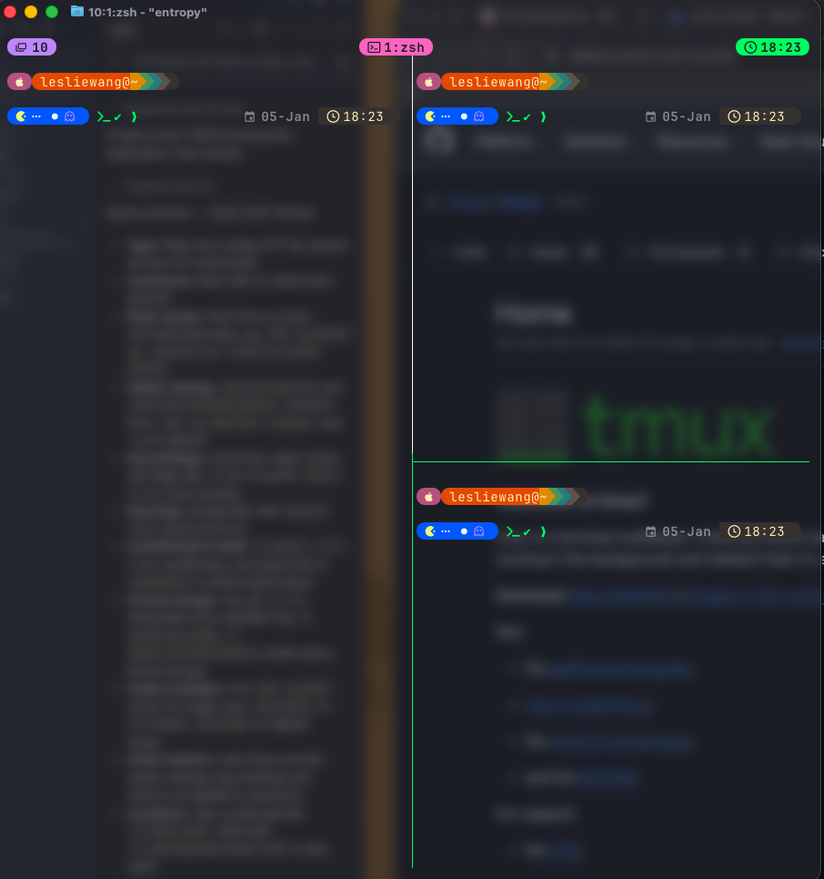

# :octicons-package-dependents-16: How to configure

> Ghostty supports hundreds of configuration options to make it look and behave exactly how you want.

The official Configuration guide is available on [**https://github.com/tmux/tmux/wiki/**](https://github.com/tmux/tmux/wiki/){target="_blank"}.

## Configuration File Location

By default, tmux looks for a configuration file named `.tmux.conf` in your home directory (`~/.tmux.conf`).

## My tmux Configuration

??? tip "Screenshot of my Tmux configuration"

    {width="600px"}

```bash title="~/.tmux.conf" linenums="1"

# ==========================================
# 1. GNU SCREEN COMPATIBILITY
# ==========================================
# Change prefix to Ctrl+x
unbind C-b
set -g prefix C-x
bind C-x send-prefix

# Double-tap Ctrl+x to switch to the last active window
# (Press Ctrl, then tap x twice)
bind C-x last-window

# 1. Use tmux-256color instead of screen (better for Dracula)
set -g default-terminal "tmux-256color"

# 2. This is the "magic line" for Ghostty to allow True Color
set -as terminal-overrides ',xterm*:Tc:sitm=\E[3m'

# 3. Ensure tmux knows Ghostty supports RGB
set -as terminal-features ",xterm*:RGB"

# Optional: Use the Dracula Tmux theme to match your status bar
set -g @plugin 'dracula/tmux'

# Dracula plugin settings
set -g @dracula-show-powerline true
set -g @dracula-fixed-location "Your City"
set -g @dracula-plugins "weather time"
set -g @dracula-show-flags true
set -g @dracula-show-left-icon session

# ==========================================
# 2. GENERAL SETTINGS
# ==========================================
set -g mouse on               # Enable mouse support
set -g base-index 1           # Start windows at 1
setw -g pane-base-index 1     # Start panes at 1
set -s escape-time 0          # Fix Vim escape delay
set -g history-limit 1000000  # Increase scrollback buffer
set -g set-titles on          # Set terminal title
setw -g mode-keys vi          # Use Vim keys in copy mode

# Reload config shortcut
bind r source-file ~/.tmux.conf \; display "Config Reloaded!"

# ==========================================
# 3. PANE & WINDOW MANAGEMENT
# ==========================================
# Split panes using | and - and stay in current directory
bind | split-window -h -c "#{pane_current_path}"
bind - split-window -v -c "#{pane_current_path}"

# Easier pane navigation (Alt + Arrows without prefix)
bind -n M-Left select-pane -L
bind -n M-Right select-pane -R
bind -n M-Up select-pane -U
bind -n M-Down select-pane -D

# ==========================================
# 4. STATUS BAR UI (TOP & TRANSPARENT)
# ==========================================
set -g status-position top
set -g status-justify centre
set -g status-style bg=default
set -g status-left-length 30
set -g status-right-length 30

# Left Side: Session Name [󱂬 Session]
set -g status-left "#[fg=blue]#[fg=black,bg=blue,bold]󱂬 #S#[fg=blue,bg=default]"

# Right Side: Time [ 12:00]
set -g status-right "#[fg=green]#[fg=black,bg=green,bold] %H:%M#[fg=green,bg=default]"

# Inactive Window: [ 1:bash]
setw -g window-status-format "#[fg=brightblack]#[fg=white,bg=brightblack]#I:#W#[fg=brightblack,bg=default]"

# Active Window: [ 1:vim] with Zoom Detection
# If zoomed, icon changes to 󰊓
setw -g window-status-current-format "#[fg=magenta]#[fg=black,bg=magenta,bold]#{?window_zoomed_flag,󰊓,} #I:#W#[fg=magenta,bg=default]"

# ==========================================
# 5. COMMAND PROMPT & SELECTION
# ==========================================
# Messaging & Command Line
set -g message-style "fg=magenta,bg=default,bold"
set -g message-command-style "fg=cyan,bg=default,bold"

# Visual Selection (Copy Mode)
setw -g mode-style "fg=black,bg=magenta"

# ==========================================
# 6. TOGGLES
# ==========================================
# Press Prefix + t to hide/show the status bar
bind t set-option status


# ==========================================
# 7. PLUGIN MANAGEMENT
# ==========================================
# List of plugins
set -g @plugin 'tmux-plugins/tpm'
set -g @plugin 'tmux-plugins/tmux-sensible'
set -g @plugin 'tmux-plugins/tmux-resurrect'
set -g @plugin 'tmux-plugins/tmux-continuum'

# Automatic restore for tmux-continuum
set -g @continuum-restore 'on'

# Initialize TMUX plugin manager (keep this line at the very bottom)
run '~/.tmux/plugins/tpm/tpm'

```
